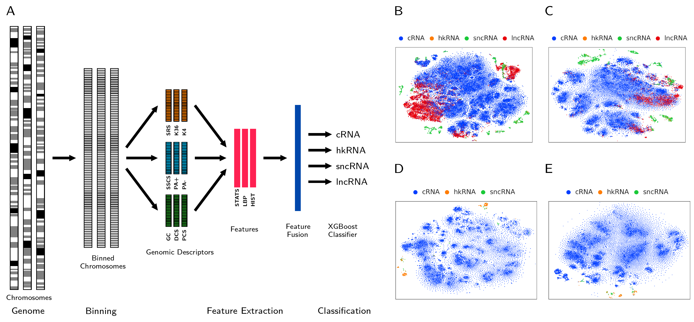

# RNAC - RNA Classifier

RNAC categorizes the RNAs into coding (cRNA), housekeeping (hkRNA), small non-coding (sncRNA) and long non-coding (lncRNA) classes using statistical, Local Binary Patterns (LBP) and Histogram features from genomic descriptors. It is implemented in python 3.




Details of Source Code
-------------------------
* **DESC** - Genomic descriptors for all species.
* **LBPDESC** - LBP codes of genomic descriptors for all species.
* **PRECOMPUTED_FEAT** - Pre-computed features for all species.
* **MODELS** - XGBoost models for multiclass and binary classification problems.
* **UTILS** - Additional files for feature extraction, data normalization and feature selection
* **TEST_SAMPLES** - Testing samples
* **TEST_OUTPUT** - Classification outputs
* **RNAC.py** - Code for testing unknown transcripts
* **CALC_FEAT.py** - Code for Feature Extraction
* **CALC_LBP.py** - Code for computing LBP codes of genomic descriptors

How to Use
-----------

1. Download the code and install the REQUIRED PACKAGES
```
* python == 3.7.0
* h5py == 2.10.0
* scipy == 1.5.2
* xgboost == 1.3.0
* numpy == 1.19.1
* pandas == 1.1.5
* scikit_learn == 0.24.1
```
2. Download the supporting data from the links provided in [*DESC*](https://github.com/cbl-nabi/RNAC/tree/main/DESC), [*LBPDESC*](https://github.com/cbl-nabi/RNAC/tree/main/LBPDESC), [*PRECOMPUTED_FEAT*](https://github.com/cbl-nabi/RNAC/tree/main/PRECOMPUTED_FEAT), and [*MODELS*](https://github.com/cbl-nabi/RNAC/tree/main/MODELS) folders.

3. Using RNAC for testing

Run [*RNAC.py*](https://github.com/cbl-nabi/RNAC/blob/main/RNAC.py) to obtain the multiclass and binary outcomes with following command:
```
python RNAC.py --Multiclass --Human Human.gtf
```
To get help about parameters, type [*python RNAC.py -h or --help*]
```
Usage: python RNAC.py [--classification-type] [--species] [-gtf_file]

classification-type: 	 {Multiclass, Binary}
species: 		 {Human, Mouse, Caenorhabditis_elegans, Arabidopsis_thaliana}
gtf_file: 		 GTF file location

Example: python RNAC.py --Binary --Caenorhabditis_elegans ./TEST_SAMPLES/Caenorhabditis_elegans.gtf

Note: RNAC supports Multiclass (cRNA, hkRNA, sncRNA and lncRNA) and Binary (coding vs non-coding) classification of these four species only.
```
The code has been tested with Python 3.6 (conda) and Ubuntu 14.04.

The sample gtf files have been provided in the [*TEST_SAMPLES*](https://github.com/cbl-nabi/RNAC/tree/main/TEST_SAMPLES) folder to check the successful installation of RNAC.

Citation
-----------
Singh D., Madhawan A. and Roy J., *Identification of multiple RNAs using feature fusion*, 2021 

Also, do not forget to cite [COME's Paper](https://academic.oup.com/nar/article/45/1/e2/2871107)